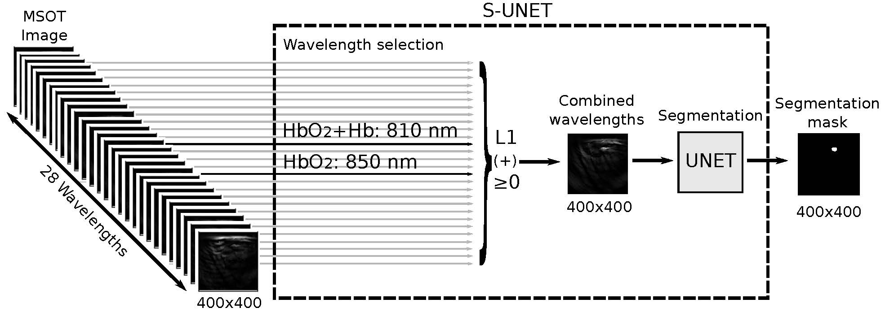

# A Sparse Deep Learning Approach for Automatic Segmentation of Human Vasculature in Multispectral Optoacoustic Tomography

This repository provides the S-UNET architecture for interpretable segmentation of optoacoustic images, as demonstrated in [the S-UNET paper.](https://www.biorxiv.org/content/10.1101/833251v1).

The S-UNET architecture takes as input 400x400x28 optoacoustic images (28 different wavelengths/image channels) and predicts a single 400x400x1 binary segmentation mask per image. Zero pixels in the mask correspond to background, while pixels equal to one correspond to a blood vessel. Additionally, the S-UNET identifies in a data-driven manner which of the 28 wavelengths are more important for the segmentation task. In our application, the S-UNET identified 810 and 850nm as more important, with both channels having physical meaning for the segmentation task at hand.

The architecture can be found in the following file: [sunet_model.py](./sunet_model.py).

If you use the S-UNET architecture please consider citing the above manuscript.
